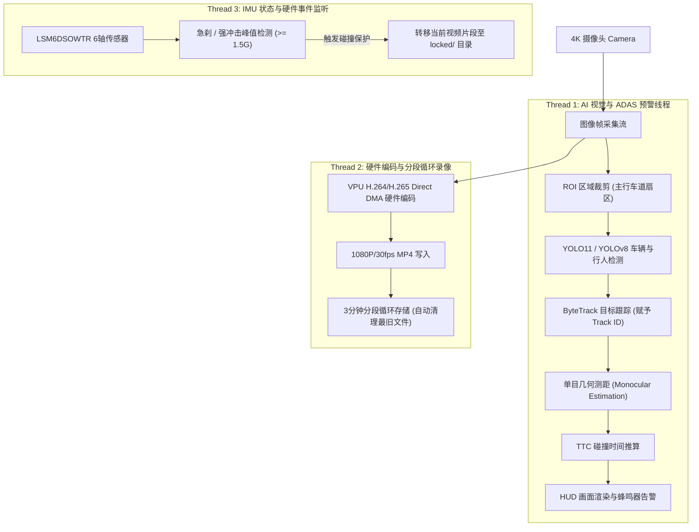

# 📐 MaixCAM 2 AI Dashcam & FCW 技术架构与算法规范

## 1. 软件流水线架构 (Pipeline Architecture)

系统采用多线程/多流异步架构，将高负载任务彻底解耦：



---

## 2. 核心数学模型与算法公式

### 2.1 单目几何测距模型 (Monocular Distance Estimation)
* **标定参数**：
  * 相机离地高度 $H$（如安装在房车/轿车后视镜区域，默认为 $1.3\text{ m}$）
  * 相机俯仰角 $\theta_{\text{pitch}}$（通过板载 IMU 或静态标定获得）
  * 垂直视场角 $FOV_v$ 与图像高度 $H_{\text{img}}$
  * 焦距像素值 $f_y = \frac{H_{\text{img}} / 2}{\tan(FOV_v / 2)}$
* **距离计算公式**：
  对于前方车辆的接地底边坐标 $y_{\text{bottom}}$：
  $$\alpha = \arctan\left(\frac{y_{\text{bottom}} - y_{\text{center}}}{f_y}\right)$$
  实际纵向距离 $D$ 为：
  $$D = \frac{H}{\tan(\theta_{\text{pitch}} + \alpha)}$$

### 2.2 TTC (Time-to-Collision) 碰撞时间计算
* 对于同一个被跟踪目标（相同 `Track ID`）：
  * 前一时刻 $t - \Delta t$ 距离为 $D_{t-\Delta t}$，当前时刻 $t$ 距离为 $D_t$
  * 相对逼近速度：
    $$v_{\text{rel}} = \frac{D_{t-\Delta t} - D_t}{\Delta t}$$
  * **碰撞时间 TTC**：
    $$TTC = \begin{cases} 
    \frac{D_t}{v_{\text{rel}}}, & \text{if } v_{\text{rel}} > 0.5\text{ m/s} \\
    \infty, & \text{if } v_{\text{rel}} \le 0.5\text{ m/s (相对远离或静止)}
    \end{cases}$$

### 2.3 告警决策矩阵 (Alert Decision Matrix)

| 场景 | 相对距离 $D$ | 逼近速度 $v_{\text{rel}}$ | TTC 时间 | 告警级别与动作 |
| :--- | :--- | :--- | :--- | :--- |
| **红灯/堵车静止跟车** | $< 5\text{ m}$ | $\approx 0\text{ m/s}$ | $\infty$ | **静音/常态框 (无警报)** |
| **正常跟车微速逼近** | $> 15\text{ m}$ | $< 1\text{ m/s}$ | $> 10\text{ s}$ | **安全绿色框** |
| **前车减速/前向逼近** | $< 35\text{ m}$ | $> 3\text{ m/s}$ | $2.0\text{ s} \sim 2.8\text{ s}$ | **Level 1 (黄色注意框 + 短促滴声)** |
| **紧急急刹/危险逼近** | $< 25\text{ m}$ | 快速逼近 | $< 1.8\text{ s}$ | **Level 2 (红色警报框 + 持续高频蜂鸣)** |

---

## 3. 存储与目录规划

设备存储（64GB eMMC 或 MicroSD 卡）目录划分：
```text
/maixapp/data/dashcam/
├── normal/          # 正常分段录像 (每段 3 分钟，约 120MB，空间超 80% 自动 FIFO 循环覆盖)
├── locked/          # G-Sensor 碰撞或手动按键加锁片段 (永久保护，不自动删除)
└── snapshots/       # FCW 危险触发抓拍与高危事件小图
```

---

## 4. 落地步骤规划 (Implementation Roadmap)

1. **阶段 1：几何测距与目标跟踪纯算法闭环 (Mock / Single Camera Test)**
   * 实现 `FCWTracker` 类与单目测距几何运算，验证 TTC 算法在视频回放中的稳定性。
2. **阶段 2：IMU G-Sensor 碰撞阈值实测**
   * 调取板载 `LSM6DSOWTR`，实测车辆启停、减速带与急刹工况下的 G 值分布，校准 $1.5\text{G}$ 触发门限。
3. **阶段 3：多线程 UI 与 VPU 录像集成**
   * 编写 `main.py` 与 `DisplayHAL`，合并 1080P H.265 硬件分段录像与暗黑极简 HUD 界面。
4. **阶段 4：真车部署与参数标定**
   * 安装于车前挡风玻璃，通过 `deploy.sh` 脚本一键同步至 MaixCAM 2 并进行实际路测。
