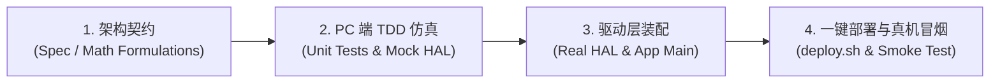

# 🛠️ MaixCAM 2 边缘 AI 敏捷开发规范与方法论 (Development Guide)

## 1. 核心方法论：TDD 仿真驱动 + HAL 硬件解耦

在 **嵌入式边缘 AI + 多传感器（NPU + Camera + IMU + VPU）** 项目中，传统“频繁肉身刷机/上板调试”效率极低，而“纯文档设计”又容易脱离真实时序与算力限制。

本项目统一采用 **“架构契约 -> TDD 仿真打穿 -> HAL 硬件解耦 -> 一键 SSH 冒烟”** 四位一体敏捷开发模式：

---

## 2. 四阶段开发流水线 (The 4-Step Pipeline)

### 阶段 1：数学与状态机 TDD（0 依赖本地闭环）
* **核心原则**：**所有算法、数学推导与预警状态机代码，禁止直接调用任何硬件专有库（如 `_maix`, `maix.nn`）**。
* **执行方式**：
  * 在 `tests/test_fcw_tracker.py` 中预置各类道路工况数据帧（时间戳、BBox 坐标、底边像素）。
  * 验证 **TTC 导数计算、目标丢失超时注销、红灯静止防误报** 等核心用例。
  * 运行 `python3 -m unittest discover tests`，确保在 PC 本地毫秒级 100% 绿灯。

### 阶段 2：IMU 与事件逻辑 TDD
* **核心原则**：传感器输入通过抽象接口注入。
* **执行方式**：
  * 模拟不同加速度阶跃信号（正常行车颠簸、路面减速带冲击、紧急制动 $\ge 1.5\text{G}$）。
  * 验证紧急加锁状态机与目录轮替调度逻辑。

### 阶段 3：HAL 硬件抽象层组装 (Hardware Assembly)
* **核心原则**：单一职责，将真实硬件驱动（`camera`, `display`, `ext_dev.imu`, `maix.video`）封装在 `apps/hal/` 中。
* **开发内容**：
  * 将经过 TDD 验证的纯逻辑模块接入真实硬件数据流。
  * 采用双线程/多线程解耦：AI 推理（`640x384`）与硬件 VPU 录像（`1080P H.265`）互不阻塞。

### 阶段 4：一键部署与硬件冒烟门禁 (Automated Deployment & Quality Gate)
* **执行方式**：
  * 执行 `./deploy.sh`：
    1. 自动在本地运行全部单元测试；
    2. 通过 SSH/SCP 增量同步自包含 App 包至 MaixCAM 2（`/maixapp/apps/camp_dashcam/`）；
    3. 在板端执行轻量级冒烟检查（硬件驱动唤醒、NPU 模型载入、存储目录可写）；
    4. 刷新桌面 launcher 索引。

---

## 3. 测试用例边界设计矩阵 (Test Matrix)

| 场景分类 | 测试用例名称 | 模拟输入特征 | 期望断言 (Expected Assertion) |
| :--- | :--- | :--- | :--- |
| **误报抑制** | `test_red_light_standstill_no_alert` | 前车距离 $3\text{ m}$，但相对速度 $v_{\text{rel}} \le 0.1\text{ m/s}$ | `alerts == []`（绝对静音） |
| **危险预警** | `test_rapid_approaching_critical_alert` | 距离 $20\text{ m}$，相对逼近速度 $12\text{ m/s}$ ($TTC \approx 1.6\text{s}$) | `alert.level == 'CRITICAL'` |
| **内存与生命周期** | `test_stale_track_deregistration` | 目标连续 5 帧未在检测框中出现 | `track_id` 从内存表中自动释放，无泄漏 |
| **IMU 碰撞防御** | `test_g_sensor_emergency_trigger` | 注入加速度冲击模长 $1.8\text{G}$ | `is_locked == True`，触发录像加锁流程 |
| **异常容错** | `test_zero_division_guard` | $\Delta t \to 0$ 或极端奇异坐标输入 | 容错保护，默认降级为安全状态，不 Crash |
